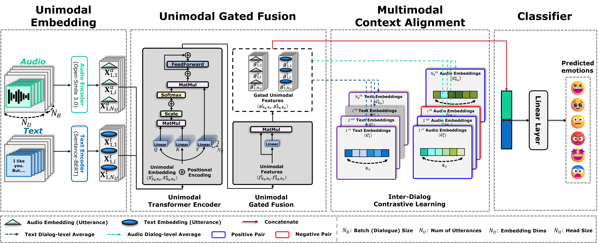
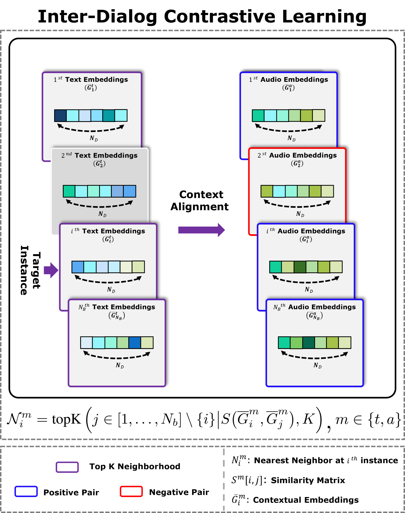

# [ICASSP 2026] INTER-DIALOG CONTRASTIVE LEARNING FOR MULTIMODAL EMOTION RECOGNITION IN CONVERSATIONS

**Dong-Hyuk Lee**, **Dae Hyeon Kim**, **Young-Seok Choi***

Department of Electronics and Communications Engineering, Kwangwoon University, Seoul, South Korea

---

## 📢 News
* **[Jan, 2026]** 🎉 Our paper **"INTER-DIALOG CONTRASTIVE LEARNING FOR MULTIMODAL EMOTION RECOGNITION IN CONVERSATIONS"** has been accepted to **ICASSP 2026**!
* **[Coming Soon]** 🚀 The official code and pre-trained models for **IDCL** will be released soon.

---

## 📝 Abstract
Multimodal Emotion Recognition in Conversations (MERC) is challenging due to the complex interplay between modalities and the critical role of contextual information. While previous studies have primarily focused on context within a single conversation (intra-dialog), this work explores a new dimension: the contextual information shared across different conversations. 

We introduce **Inter-Dialog Contrastive Learning (IDCL)**, a novel framework that leverages inter-dialog similarities to enhance multimodal representation learning. IDCL operates on the hypothesis that conversations with similar emotional trajectories share underlying contextual patterns. By maximizing the similarity between these emotionally congruent dialogs and minimizing it for incongruent ones, IDCL learns more robust and generalizable representations. 

Experiments on the **IEMOCAP** dataset demonstrate that our approach establishing the importance of inter-dialog context for advancing emotion recognition.

<table border="0">
  <tr>
    <td align="center">
      
       
      <em>Figure 1: Overall Architecture</em>
    </td>
    <td align="center">
      
       
      <em>Figure 2: IDCL Framework</em>
    </td>
  </tr>
</table>

## 📊 Experimental Results

To validate the explicit contribution of our proposed **Inter-Dialog Contrastive Learning (IDCL)** framework, we conducted ablation studies on the IEMOCAP dataset. We compared three settings to isolate the effect of the IDCL objective from transfer learning.

| Model Setting | IEMOCAP (4-way) Acc (%) / WF1 (%) | IEMOCAP (6-way) Acc (%) / WF1 (%) | Note |
| :--- | :---: | :---: | :--- |
| **(A) Baseline** *(Cross-Entropy only)* | 80.8 / 80.8 | 65.4 / 65.7 | Baseline |
| **(B) IDCL (from Scratch)** *(w/o Pre-training)* | 82.5 / 82.5 | 65.8 / 66.2 | **Proves IDCL Efficacy** |
| **(C) Proposed Full Model** *(with Pre-training)* | **85.9 / 85.8** | **66.4 / 66.6** | **SOTA Performance** |

> **Key Findings:**
> 1.  **Intrinsic Robustness:** Comparing **(B)** with **(A)**, IDCL alone improved accuracy by **1.7%** (4-way), proving that the IDCL objective effectively learns robust representations by leveraging inter-dialog context, even without external data.
> 2.  **Synergy with Pre-training:** The proposed full model **(C)** achieved the highest performance (+5.1% over baseline), confirming a strong synergy between IDCL and transfer learning strategies.

## 🗓️ To-Do List
We are currently organizing the code for release.
- [ ] Upload usage
- [ ] Upload IDCL training code
- [ ] Share pre-trained weights

---
